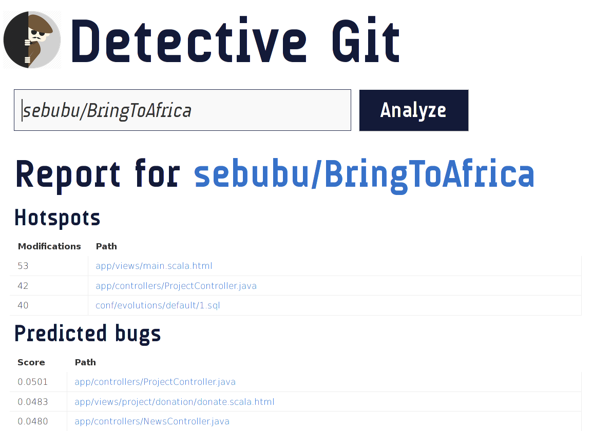

# detectivegit

## How it works

flinter works a bit differently - instead of receiving updates about a repo
via a webhook we just track all C++ repos via the [Github Realtime Realy](https://github.com/lukasmartinelli/ghrr).

## API

There is a single ressource `Repo` which encapsulates a repository
flinter keeps track of.

